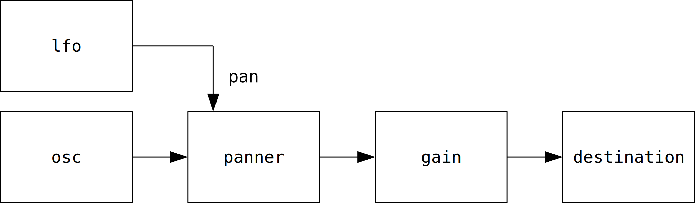

# Hello WebAudio
サイン波を鳴らします。Firefox か Chrome なら <kbd>Ctrl</kbd> + <kbd>Shift</kbd> + <kbd>i</kbd> で[開発者ツール](https://developer.mozilla.org/ja/docs/Learn/Common_questions/What_are_browser_developer_tools)を開いて、[コンソール](https://developer.mozilla.org/ja/docs/Tools/Web_Console)に以下のコードをコピペすれば音が出ます。

```javascript
var ctx = new AudioContext()

var gain = ctx.createGain()
gain.gain.value = 0.1
gain.connect(ctx.destination)

var panner = ctx.createStereoPanner()
panner.pan.value = 0
panner.connect(gain)

var lfo = ctx.createOscillator()
lfo.type.value = "sine"
lfo.frequency.value = 0.6
lfo.detune.value = 0
lfo.connect(panner.pan)
lfo.start()

var osc = ctx.createOscillator()
osc.type.value = "sine"
osc.frequency.value = 600
osc.detune.value = 0
osc.connect(panner)
osc.start()
```

このサイン波を鳴らすコードでは、次のように[ノード](https://webaudio.github.io/web-audio-api/)を繋いでいます。

<figure>

</figure>

WebAudioのAPIは [`AudioContext`](https://webaudio.github.io/web-audio-api/#AudioContext) から使うことができます。

```javascript
var ctx = new AudioContext()
```

`ctx.createSomeNode()` という関数で何らかのノードを作って [`someNode.connect(anotherNode)`](https://webaudio.github.io/web-audio-api/#dom-audionode-connect) で出力を別のノードに接続できます。

ノードの接続先には [`AudioParam`](https://webaudio.github.io/web-audio-api/#AudioParam) として定義されているパラメータも指定できます。先のコードでは `lfo.connect(panner.pan)` の部分が該当します。

`ctx.destination` は [`AudioDestinationNode`](https://webaudio.github.io/web-audio-api/#AudioDestinationNode) を表しています。 `AudioDestinationNode` はWebAudioで作られた音が最後にたどり着く場所です。ミキサのマスタチャンネルのようなものですがゲインやパンのコントロールはありません。ゲインは [`GainNode`](https://webaudio.github.io/web-audio-api/#gainnode) 、パンはステレオに振るだけなら [`StereoPannerNode`](https://webaudio.github.io/web-audio-api/#stereopannernode) が使えます。

- [AudioContext](https://webaudio.github.io/web-audio-api/#AudioContext)
- [AudioDestinationNode](https://webaudio.github.io/web-audio-api/#AudioDestinationNode)
- [AudioParam](https://webaudio.github.io/web-audio-api/#AudioParam)
- [OscillatorNode](https://webaudio.github.io/web-audio-api/#oscillatornode)
- [GainNode](https://webaudio.github.io/web-audio-api/#gainnode)
- [StereoPannerNode](https://webaudio.github.io/web-audio-api/#stereopannernode)
