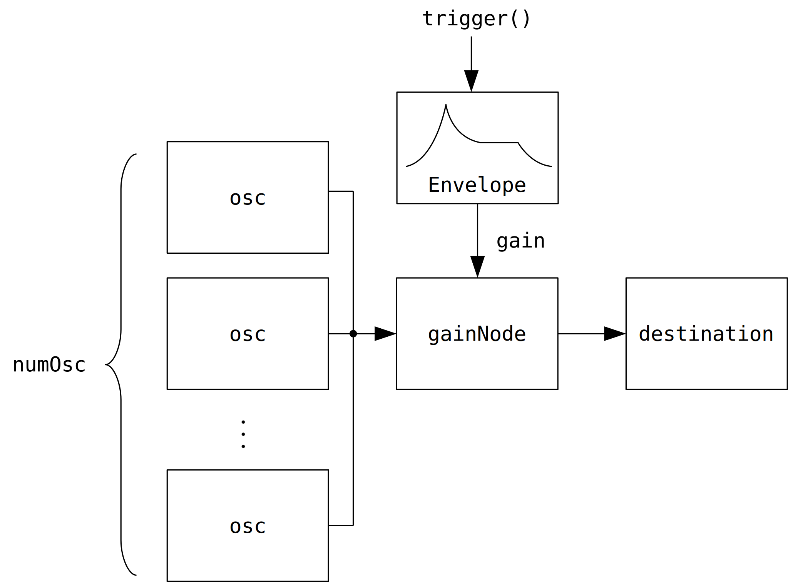

# AudioParamでオートメーション
[`AudioParam`](https://webaudio.github.io/web-audio-api/#AudioParam) として定義されているノードのパラメータは、次の関数を組み合わせてオートメーションができます。

- [`setValueAtTime`](https://webaudio.github.io/web-audio-api/#dom-audioparam-setvalueattime)
- [`linearRampToValueAtTime`](https://webaudio.github.io/web-audio-api/#dom-audioparam-linearramptovalueattime)
- [`exponentialRampToValueAtTime`](https://webaudio.github.io/web-audio-api/#dom-audioparam-exponentialramptovalueattime)
- [`setTargetAtTime`](https://webaudio.github.io/web-audio-api/#dom-audioparam-settargetattime)
- [`setValueCurveAtTime`](https://webaudio.github.io/web-audio-api/#dom-audioparam-setvaluecurveattime)
- [`cancelScheduledValues`](https://webaudio.github.io/web-audio-api/#dom-audioparam-cancelscheduledvalues)
- [`cancelAndHoldAtTime`](https://webaudio.github.io/web-audio-api/#dom-audioparam-cancelandholdattime)

オートメーションの開始・終了時刻を指定するときは [`AudioContext.currentTime`](https://webaudio.github.io/web-audio-api/#dom-baseaudiocontext-currenttime) を使います。

```javascript
var ctx = new AudioContext()
ctx.currentTime // AudioContext のインスタンスが生成されてからの経過時間 [秒] 。
```

ここではオートメーションを使ってエンベロープを作り、簡単なシーケンスを演奏します。

## シンセサイザのエンベロープ
シンセサイザで使われるエンベロープは、トリガされると low から high に向かって増加したあと high から low に向かって減少するような信号を出力します。エンベロープの出力をオシレータの出力やサンプルデータと掛け合わせることで音量の変化を作ることができます。

よくあるシンセサイザのエンベロープはAttack、Decay、Sustain、Releaseの4つの区間が組み合わさっています。4つの区間をそれぞれ1文字に略してADSRと言うことがあります。次の図はADSRエンベロープを表しています。

<figure>

</figure>

Attack は low から high までの立ち上がりにかかる時間、 Decay は high から Sustain の値までの減衰にかかる時間です。

Sustainは、Decayの終わりから指が鍵盤が離される([ノートオフ](https://www.g200kg.com/jp/docs/dic/noteoff.html))までの区間ですが、ユーザが操作するパラメータとしてはその区間でエンベロープが出力する値の大きさになっています。

Releaseはノートオフの後、エンベロープが low まで減衰するのにかかる時間です。AttackやDecayの途中でノートオフされたときもReleaseに移行します。

### 実装
次の図のようなルーティングのシンセサイザを実装します。

<figure>

</figure>

```javascript
function createOscillator(audioContext, parentNode, type, frequency, detune) {
  var osc = audioContext.createOscillator()
  osc.type = type
  osc.frequency.value = frequency
  osc.detune.value = detune
  osc.connect(parentNode)
  return osc
}

function createGain(audioContext, parentNode, gain) {
  var gainNode = audioContext.createGain()
  gainNode.gain.value = gain
  gainNode.connect(parentNode)
  return gainNode
}

class Synth {
  constructor(
    ctx,
    parent,
    gainPeak = 0.1,
    gainAttack = 0.02,
    gainDecay = 0.4,
    gainSustain = 0.01,
    gainRelease = 0.8,
    numOsc = 4,
    detuneDelta = 200,
    type = "sine",
    frequency = 440,
    detune = 0,
  ) {
    this.ctx = ctx

    this.gainNode = createGain(ctx, parent, 0)

    this.osc = new Array(numOsc)
    for (var i = 0; i < this.osc.length; ++i) {
      this.osc[i] = createOscillator(
        ctx, this.gainNode, type, frequency, detune + detuneDelta * i)
      this.osc[i].start()
    }

    this.gainPeak = gainPeak / numOsc
    this.gainAttack = gainAttack
    this.gainDecay = gainDecay
    this.gainSustain = gainSustain
    this.gainRelease = gainRelease
  }

  scheduleLinADS(audioParam, peak, attack, decay, sustain) {
    var currentTime = this.ctx.currentTime
    audioParam.cancelScheduledValues(currentTime)
    audioParam.linearRampToValueAtTime(0, 0.002 + currentTime)
    audioParam.linearRampToValueAtTime(peak, attack + currentTime)
    audioParam.linearRampToValueAtTime(sustain, attack + decay + currentTime)
  }

  scheduleLinRelease(audioParam, release) {
    var currentTime = this.ctx.currentTime
    audioParam.linearRampToValueAtTime(0, release + currentTime)
  }

  trigger() {
    this.scheduleLinADS(this.gainNode.gain, this.gainPeak,
      this.gainAttack, this.gainDecay, this.gainSustain)
  }

  release() {
    this.scheduleLinRelease(this.gainNode.gain, this.gainRelease)
  }
}

var ctx = new AudioContext()
var synth = new Synth(ctx, ctx.destination,
  0.1, 0.3, 0.6, 0.01, 1.2, 8, 500.01, "square", 440, 0)
```

次のボタンを押すと `Synth.trigger` 、離すと `Synth.release` を呼び出します。

<div id="divSynthTrigger"></div>

`scheduleLinADS` の次の行は、リリースの途中で再度トリガされたときにエンベロープが 0 にリセットされるようにしています。

```javascript
    audioParam.linearRampToValueAtTime(0, 0.002 + currentTime)
```

次の図はリセットありとリセットなしを比べています。エンベロープの緑で強調した部分が違いです。AとBの時間の長さは同じです。

<figure>

</figure>

0.002 という値は適当に決めた値です。この値が小さすぎるとエンベロープがリセットされたときにプチノイズが聞こえることがあります。

`linearRampToValueAtTime` を `exponentialRampToValueAtTime` に変えてみます。

```javascript
// Synth のメソッド
  scheduleExpADS(audioParam, peak, attack, decay, sustain) {
    var currentTime = this.ctx.currentTime
    audioParam.cancelScheduledValues(currentTime)
    audioParam.linearRampToValueAtTime(1e-4, 0.002 + currentTime)
    audioParam.exponentialRampToValueAtTime(peak, attack + currentTime)
    audioParam.exponentialRampToValueAtTime(sustain, attack + decay + currentTime)
  }

  scheduleExpRelease(audioParam, release) {
    var currentTime = this.ctx.currentTime
    audioParam.exponentialRampToValueAtTime(1e-4, release + currentTime)
    audioParam.linearRampToValueAtTime(0, release + 0.001 + currentTime)
  }
```

`exponentialRampToValueAtTime` は一つ目の引数 `value` に 0 が指定できないので、代わりに 1e-4 という適当に決めた値を使っています。リリースの終了後に 0 にリセットするため `linearRampToValueAtTime` を一つ加えています。

次のボタンで `exponentialRampToValueAtTime` を使ったエンベロープを試聴できます。

<div id="divSynthTriggerExpADSR"></div>

## シーケンスの演奏
とりあえず `Synth` を拡張してシーケンスを演奏させてみます。

```javascript
class Synth {

  // 途中を省略

  scheduleNoteEnv(
    startTime,
    duration,
    audioParam,
    peak,
    attack,
    decay,
    sustain,
    release
  ) {
    audioParam.setValueAtTime(1e-4, startTime)
    audioParam.linearRampToValueAtTime(1e-4, 0.002 + startTime)

    var attackTime = attack + startTime
    audioParam.exponentialRampToValueAtTime(peak, attackTime)
    audioParam.exponentialRampToValueAtTime(sustain, decay + attackTime)

    var releaseTime = duration + release + startTime
    audioParam.exponentialRampToValueAtTime(1e-4, releaseTime)
    audioParam.linearRampToValueAtTime(0, 0.001 + releaseTime)
  }

  scheduleNote(startTime, duration, frequency) {
    for (var i = 0; i < this.osc.length; ++i) {
      this.osc[i].frequency.setValueAtTime(frequency, startTime)
    }

    this.scheduleNoteEnv(
      startTime,
      duration,
      this.gainNode.gain,
      this.gainPeak,
      this.gainAttack,
      this.gainDecay,
      this.gainSustain,
      this.gainRelease
    )
  }
}

var synths = []
for (var i = 0; i < 8; ++i) {
  synths.push(new Synth(ctx, ctx.destination,
    0.1, 0.03, 0.2, 0.01, 1.2, 3, 200 + 200 * Math.random(), "square", 440, 0))
}

var seq = []
var startTime = 0

// 適当なシーケンスを作成。
for (var i = 0; i < 64; ++i) {
  seq.push({
    frequency: (Math.floor(Math.random() * 23 + 1) * 60)
      * (1 + 0.01 * Math.random()),
    duration: Math.random() + 0.01,
    startTime: startTime,
  })
  startTime += 0.1 + Math.random() * 0.3
}

var divSequence = document.getElementById("divSequence")

// Button は <input type="button"> を簡単に作るためのクラス。
// 三つ目の引数は click イベントに応じて呼び出される。
var buttonSeq = new Button(divSequence, "Start Sequence", () => {
  for (var i = 0; i < seq.length; ++i) {
    synths[i % synths.length].scheduleNote(
      ctx.currentTime + seq[i].startTime, seq[i].duration, seq[i].frequency)
  }
})
```

次のボタンで演奏を開始します。

<div id="divSequence1"></div>

複数のノートが同時に演奏される場合のために、複数の `Synth` を作っています。 `i` 番目のノートを `synths[i % synth.length]` にスケジュールしています。上のボタンで演奏するとところどころ正しく再生されていない部分があるように聞こえます。

ノートごとに新しいノードを作る方法で演奏してみます。

```javascript
class Synth2 {
  constructor(
    ctx,
    parent,
    gainPeak = 0.1,
    gainAttack = 0.02,
    gainDecay = 0.4,
    gainSustain = 0.01,
    gainRelease = 0.8,
    type = "sine",
    detune = 0,
  ) {
    this.ctx = ctx

    this.parent = parent

    this.type = type
    this.detune = detune

    this.gainPeak = gainPeak
    this.gainAttack = gainAttack
    this.gainDecay = gainDecay
    this.gainSustain = gainSustain
    this.gainRelease = gainRelease

    this.usedNode = []
  }

  createNode(frequency) {
    var gain = createGain(this.ctx, this.parent, 0)
    var osc = createOscillator(
      this.ctx, gain, this.type, frequency, this.detune)
    return { gain: gain, osc: osc }
  }

  scheduleNoteEnv(
    startTime,
    duration,
    audioParam,
    peak,
    attack,
    decay,
    sustain,
    release
  ) {
    audioParam.setValueAtTime(0, startTime)
    audioParam.linearRampToValueAtTime(1e-4, 0.002 + startTime)

    var attackTime = attack + startTime
    audioParam.exponentialRampToValueAtTime(peak, attackTime)
    audioParam.exponentialRampToValueAtTime(sustain, decay + attackTime)

    var releaseTime = duration + release + startTime
    audioParam.exponentialRampToValueAtTime(1e-4, releaseTime)
    audioParam.linearRampToValueAtTime(0, 0.001 + releaseTime)
  }

  scheduleNote(startTime, duration, frequency) {
    var node = this.createNode(frequency)

    node.osc.start(startTime)

    this.scheduleNoteEnv(
      startTime,
      duration,
      node.gain.gain,
      this.gainPeak,
      this.gainAttack,
      this.gainDecay,
      this.gainSustain,
      this.gainRelease
    )

    this.usedNode.push(node)
  }

  midiNoteNumberToFrequency(number) {
    return 440 * Math.pow(2, (number - 69) / 12)
  }

  cleanup() {
    for (var node of this.usedNode) {
      node.gain.disconnect()
      node.osc.stop()
    }
    this.usedNode = []
  }

  // sequence = [{startTime, duration, number}, ...]
  scheduleSequence(sequence) {
    this.cleanup()

    var currentTime = this.ctx.currentTime
    for (var note of sequence) {
      this.scheduleNote(
        currentTime + note.startTime,
        note.duration,
        this.midiNoteNumberToFrequency(note.number)
      )
    }
  }
}

var scale = [0, 3, 5, 7, 9, 14, 17]
var seq2 = []
var startTime = 0
for (var i = 0; i < 64; ++i) {
  seq2.push({
    startTime: startTime,
    duration: Math.random() + 0.01,
    number: 42 + scale[Math.floor(Math.random() * scale.length)],
  })
  startTime += 0.14 * (1 + Math.floor(Math.random() + 0.5))
}
var synth2 = new Synth2(ctx, ctx.destination,
  0.1, 0.15, 0.4, 0.01, 1.8, "sine", 0)

var divSequence2 = document.getElementById("divSequence2")
var buttonSeq = new Button(divSequence2, "Start Sequence", () => {
  synth2.scheduleSequence(seq2)
})
```

次のボタンで演奏を開始します。

<div id="divSequence2"></div>

毎回ノードを作り直す方が滑らかに演奏されます。使い終わったノードは [`disconnect`](https://webaudio.github.io/web-audio-api/#dom-audionode-disconnect) した上で、どこからも参照されないようにすることでガベージコレクタに回収されるようです。

- [Web Audio API - AudioNode - Lifetime](https://webaudio.github.io/web-audio-api/#lifetime-AudioNode)

<script type="module" src="02_audioparam.js"></script>
