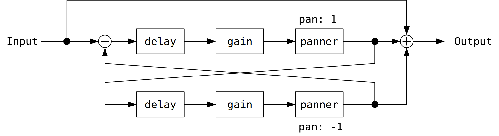
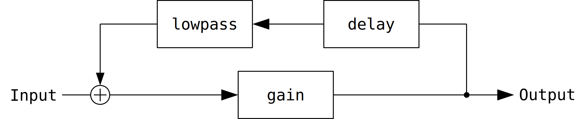
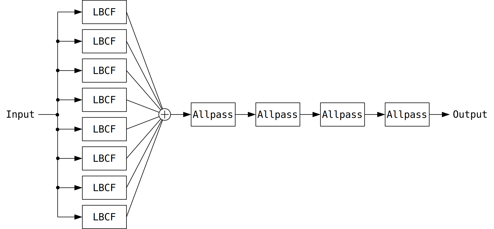
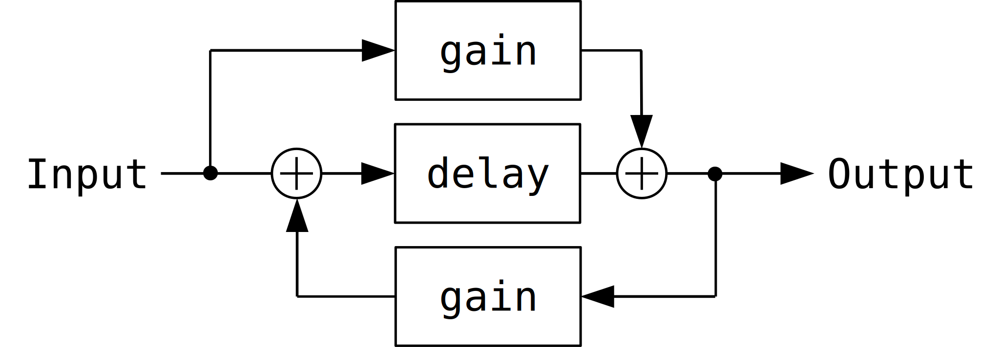

# ディレイ
[`DelayNode`](https://webaudio.github.io/web-audio-api/#DelayNode) を使います。

## 注意
このページのデモは発散する可能性があります。 Firefox 62.0.3 ではKarplus-StrongとFreeverbのデモが発散するのでPlayしないでください。

発散したときは、ページをリロードするか、近くにある Panic ボタンを押してください。

念のために音量を小さくしておくことを推奨します。

## 準備
このページのコードを上から順に開発者ツールのコンソールにコピペしていけば実行できるようになっています。

```javascript
function toAudioBuffer(ctx, wave) {
  var channel = wave.length
  var frame = wave[0].length
  var buffer = ctx.createBuffer(channel, frame, ctx.sampleRate)
  for (var ch = 0; ch < channel; ++ch) {
    buffer.copyToChannel(new Float32Array(wave[ch]), ch, 0)
  }
  return buffer
}

function renderImpulse(ctx, channel, frame) {
  var wave = new Array(channel)
  for (var ch = 0; ch < channel; ++ch) {
    wave[ch] = new Array(frame)
    var frame_sub_1 = frame - 1
    for (var i = 0; i < frame; ++i) {
      wave[ch][i] = 0.1 * (frame_sub_1 - i) / frame * Math.random()
    }
  }
  return toAudioBuffer(ctx, wave)
}

function renderPing(ctx, channel, frame) {
  var wave = new Array(channel)
  for (var ch = 0; ch < channel; ++ch) {
    wave[ch] = new Array(frame)
    var two_pi_per_fs = 2 * Math.PI / ctx.sampleRate

    wave[ch][0] = 0
    for (var i = 1; i < wave[ch].length; ++i) {
      var decay = (frame - i - 1) / frame
      wave[ch][i] = 0.2 * decay * decay
        * Math.sin(i * two_pi_per_fs
          * (1000 + 8 * wave[ch][i - 1])
          + 0.1 * Math.random())
    }
  }
  return toAudioBuffer(ctx, wave)
}

function createBiquadFilter(ctx, type, frequency, Q, gain = 0) {
  var filter = ctx.createBiquadFilter()
  filter.type = type
  filter.frequency.value = frequency
  filter.Q.value = Q
  filter.gain.value = gain
  return filter
}

function createGain(ctx, gain) {
  var gainNode = ctx.createGain()
  gainNode.gain.value = gain
  return gainNode
}

function createDelay(ctx, time, maxTime) {
  var delay = ctx.createDelay(maxTime)
  delay.delayTime.value = time
  return delay
}

function createStereoPanner(ctx, pan) {
  var panner = ctx.createStereoPanner()
  panner.pan.value = pan
  return panner
}

var ctx = new AudioContext()
var source
```

## フィードバックコムフィルタ
まずはディレイにフィードバックをつけて図のような[フィードバックコムフィルタ](https://ccrma.stanford.edu/~jos/pasp/Feedback_Comb_Filters.html)を作ります。

<figure>

</figure>

```javascript
function createKarplusStrongFilter(ctx, pitch, cutoff) {
  // 1 / freq のとき Karplus-Strong のピッチがずれる。
  // 適当な定数 60 / ctx.sampleRate を足してピッチを合わせた。
  var delay = createDelay(ctx, 1 / pitch + 60 / ctx.sampleRate, 4)
  var filter = createBiquadFilter(ctx, "lowpass", cutoff, -3, 0)
  var gain = createGain(ctx, 0.99)

  var input = gain
  var output = gain

  delay.connect(filter)
  filter.connect(gain)
  gain.connect(delay)

  return { input, output, delay, filter, gain }
}

var bufferPing = renderPing(ctx, 2, Math.floor(ctx.sampleRate / 5))
var comb = craeteCombFilter(ctx, 0.15, 0.9)

source = ctx.createBufferSource()
source.buffer = bufferPing
source.connect(comb.input)
comb.output.connect(ctx.destination)
source.start()
```

コメントにあるように `DelayNode` に指定した以上のディレイが加わって

フィードバックコムフィルタのデモです。Panicボタンを押すと音が止まります。

<div id="divComb"></div>


## ピンポンディレイ
ピンポンディレイを作ります。

<figure>

</figure>

```javascript
function createPingPongDelay(ctx, time, feedback, pan) {
  var delayL = createDelay(ctx, time, 4)
  var gainL = createGain(ctx, feedback)
  var pannerL = createStereoPanner(ctx, pan)

  var delayR = createDelay(ctx, time, 4)
  var gainR = createGain(ctx, feedback)
  var pannerR = createStereoPanner(ctx, -pan)

  var input = createGain(ctx, 1)
  var output = createGain(ctx, 1)

  input.connect(delayL)
  input.connect(output)

  delayL.connect(gainL)
  gainL.connect(pannerL)
  pannerL.connect(delayR)
  delayR.connect(gainR)
  gainR.connect(pannerR)
  pannerR.connect(delayL)

  pannerL.connect(output)
  pannerR.connect(output)

  return { input, output, delayL, gainL, pannerL, delayR, gainR, pannerR }
}

var pingpong = createPingPongDelay(ctx, 0.43, 0.5, 1)

source = ctx.createBufferSource()
source.buffer = bufferPing
source.connect(pingpong.input)
pingpong.output.connect(ctx.destination)
source.start()
```

ピンポンディレイのデモです。Panicボタンを押すと音が止まります。

<div id="divPingPong"></div>

## Karplus-Strongアルゴリズム
[Karplus-Strongアルゴリズム](https://ccrma.stanford.edu/~jos/pasp/Karplus_Strong_Algorithm.html)はフィードバックコムフィルタのフィードバックにローパスフィルタを加えることでギターなどの撥弦楽器のような音を出すアルゴリズムです。

ここではKarplus-Strongを少し変形した次の図のようなルーティングを実装します。

<figure>

</figure>

input は適当な入力信号です。ここでは撥弦楽器のような音になるよう `Math.random()` で生成した短いノイズを使っていますが、オシレータの出力などを入れてもいいです。

コードです。

```javascript
function renderNoiseBurst(ctx, channel, frame) {
  var wave = new Array(channel)
  for (var ch = 0; ch < channel; ++ch) {
    wave[ch] = new Array(frame)
    var frame_sub_1 = frame - 1
    for (var i = 0; i < frame; ++i) {
      wave[ch][i] = 0.1 * (frame_sub_1 - i) / frame * Math.random()
    }
  }
  return toAudioBuffer(ctx, wave)
}

function createKarplusStrongFilter(ctx, pitch, cutoff) {
  var delay = createDelay(ctx, 1 / pitch, 4)
  var filter = createBiquadFilter(ctx, "lowpass", cutoff, -3, 0)
  var gain = createGain(ctx, 0.99)

  var input = gain
  var output = gain

  delay.connect(filter)
  filter.connect(gain)
  gain.connect(delay)

  return { input, output, delay, filter, gain }
}

var bufferNoiseBurst = renderNoiseBurst(ctx, 2, ctx.sampleRate / 100)
var ksFilter = createKarplusStrongFilter(ctx, 220, 2000)

source = ctx.createBufferSource()
source.buffer = bufferNoiseBurst
source.connect(ksFilter.input)
ksFilter.output.connect(ctx.destination)
source.start()
```

`delayTime = 1 / pitch` とするとピッチがあわないことがあります。原因は分かりませんがフィードバックのどこかでディレイが増えたり減ったりしているようです。この文章を書いた環境では `delayTime = 1 / pitch + 60 / 44100` とすることで大体ピッチが合いました。

Karplus-Strongのデモです。Firefox 62.0.3 では発散するのでPlayしないでください。Panicボタンを押すと音が止まります。

<div id="divKarplusStrong"></div>

## リバーブ
適当にディレイをたくさん並べるとリバーブになります。ここでは[Freeverb](https://ccrma.stanford.edu/~jos/pasp/Freeverb.html)を実装します。

リバーブ全体のルーティングです。ここではチャンネル毎に別のFreeverbを用意しています。

<figure>

</figure>

Freeverbのルーティングです。

<figure>

</figure>

LBCF (Lowpass-feedBack-Comb-Filter) のルーティングです。

<figure>

</figure>

Allpass のルーティングです。

<figure>

</figure>

コードです。

```javascript
// Lowpass-feedBack-Comb-Filter
function createLBCF(ctx, time, feedback, frequency, Q) {
  // 念のために1サンプル余分にバッファを確保する。
  var delay = ctx.createDelay(time + 1.5 / ctx.sampleRate)
  delay.delayTime.value = time
  var filter = createBiquadFilter(ctx, "lowpass", frequency, Q, 0)
  var gain = createGain(ctx, feedback)

  delay.connect(filter)
  filter.connect(gain)
  gain.connect(delay)

  return { delay, filter, gain }
}

function createAllpass(ctx, time, gain) {
  var delay = ctx.createDelay(time + 1.5 / ctx.sampleRate)
  delay.delayTime.value = time
  var gainForward = createGain(ctx, gain)
  var gainBack = createGain(ctx, gain)
  var highpass = createBiquadFilter(ctx, "highpass", 20, -6, 0)

  delay.connect(highpass)
  gainForward.connect(highpass)
  highpass.connect(gainBack)
  gainBack.connect(delay)
  gainBack.connect(gainForward)

  return { delay, gainForward, gainBack, highpass }
}

function createFreeverb(ctx, channel) {
  const numLbcf = 8
  const numAllpass = 4

  var apGain = 0.5
  var randTimeAP = () => 0.012 * Math.random() + 0.004
  var randTimeLBCF = () => 0.08 * Math.random() + 0.02
  var randFreqLBCF = () => 400 * Math.pow(2, 5 * Math.random())

  var reverb = new Array(channel)
  for (var ch = 0; ch < reverb.length; ++ch) {
    var inputGain = createGain(ctx, 1 / 16)
    var outputGain = createGain(ctx, 1)

    var allpass = new Array(numAllpass)
    allpass[0] = createAllpass(ctx, randTimeAP(), apGain)
    for (var i = 1; i < allpass.length; ++i) {
      allpass[i] = createAllpass(ctx, randTimeAP(), apGain)
      allpass[i - 1].highpass.connect(allpass[i].delay)
      allpass[i - 1].highpass.connect(allpass[i].gainForward)
    }
    allpass[allpass.length - 1].delay.connect(outputGain)
    allpass[allpass.length - 1].gainForward.connect(outputGain)

    var lbcf = new Array(numLbcf)
    for (var i = 0; i < lbcf.length; ++i) {
      lbcf[i] = createLBCF(ctx, randTimeLBCF(), 0.85, randFreqLBCF(), -6)
      inputGain.connect(lbcf[i].delay)
      inputGain.connect(allpass[0].delay)
      inputGain.connect(allpass[0].gainForward)
      lbcf[i].delay.connect(allpass[0].delay)
      lbcf[i].delay.connect(allpass[0].gainForward)
    }

    reverb[ch] = { inputGain, outputGain, allpass, lbcf }
  }

  var input = ctx.createChannelSplitter(2)
  input.connect(reverb[0].inputGain, 0)
  input.connect(reverb[1].inputGain, 1)

  var merger = ctx.createChannelMerger(2)
  reverb[0].outputGain.connect(merger, 0, 0)
  reverb[1].outputGain.connect(merger, 0, 1)

  var output = createGain(ctx, 0.5)
  merger.connect(output)

  return { input, output, reverb }
}

var bufferPing = renderPing(ctx, 2, Math.floor(ctx.sampleRate / 5))
var gain = createGain(ctx, 1)
var freeverb = createFreeverb(ctx, 2)

source = ctx.createBufferSource()
source.buffer = bufferPing
source.connect(freeverb.input)
source.connect(freeverb.output)
freeverb.output.connect(ctx.destination)
source.start()
```

Freeverbのデモです。Firefox 62.0.3 では発散するのでPlayしないでください。Panicボタンを押すと音が止まります。Panicボタンを押すたびにFreeverbのパラメータがランダムに変わります。

<div id="divFreeverb"></div>

<script type="module" src="04_delay.js"></script>
